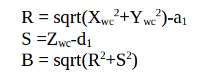

[](https://www.udacity.com/robotics)
# Robotic Arm Pick & Place Project

* To run forward kinematics test us:
```sh
$ roslaunch kuka_arm forward_kinematics.launch
```

* To run simulator use:
```sh
$ rosrun kuka_arm safe_spawner.sh
```

* To run IK Server use:
```sh
$ rosrun kuka_arm IK_server.py 
```


## Forward Kinematic Analysis

### Extracting joint positions and orientations from URDF file.


For the DH origins,locations as suggested in the lectures are selected. The x, z axes locations can be seen in relation to all of the joints below.


From the URDF file `kr210.urdf.xacro` we can extract the position xyz and orientation rpy of each joint from **origin** tag in each joint XML section:

for example, from the following fixed base joint XML section:

```xml
 <!-- joints -->
  <joint name="fixed_base_joint" type="fixed">
    <parent link="base_footprint"/>
    <child link="base_link"/>
    <origin xyz="0 0 0" rpy="0 0 0"/>
  </joint>
```
In the **origin** tag:
```xml
<origin xyz="0 0 0" rpy="0 0 0"/>
```
We can see that **xyz="0 0 0"** and **rpy="0 0 0"**. 

Following table is showing complete extracted list for all joints base to gripper:

O | joint | parent | child | x | y | z | r | p | y |
--- | --- | --- | --- | --- | --- | --- | --- | --- | --- |
0 | fixed_base | base_footprint | base_link | 0 | 0 | 0 | 0 | 0 | 0 |
1 | joint_1 | base_link | link_1 | 0 | 0 | 0.33 | 0 | 0 | 0 |
2 | joint_2 | link_1 | link_2 | 0 .35| 0 | 0.42 | 0 | 0 | 0 |
3 | joint_3 | link_2 | link_3 | 0 | 0 | 1.25 | 0 | 0 | 0 |
4 | joint_4 | link_3 | link_4 | 0.96 | 0 | -0.054 | 0 | 0 | 0 |
5 | joint_5 | link_4 | link_5 | 0.54 | 0 | 0 | 0 | 0 | 0 |
6 | joint_6 | link_5 | link_6 | 0.193 | 0 | 0 | 0 | 0 | 0 |
7 | gripper | link_6 | gripper_link | 0.11 | 0 | 0 | 0 | 0 | 0 |
. | **Total (m)** |  |  | **2.153** | 0 | **1.946** | 0 | 0 | 0 |

#### Note that:

**Origin** O(i) = intersection between Xi and Zi axis

**Link Length:** a(i-1) = Zi-1 - Zi along the X(i-1) axis

**Link Offset:** d(i) = X(i-1) - X(i) along Z(i) axis

**Link Twist:** alpha(i-1) = angle from Z(i-1) to Z(i) measured about Xi-1 using right hand rule

**Joint Angle:** theta(i) = angle from X(i-1) to X(i) measured about Zi using right hand rule. all joint angles will be zero at initial Robot state in KR210 except joint 2 which has a -90 degree constant offset between X(1) and X(2).

**Gripper frame:** is the end point that we care about. it is displaced from Frame 6 by a translation along Z(6).


### Kuka KR210 robot DH parameters.

Using the above mentioned formulas, we can generate the DH parameters table as following:

Links | i | alpha(i-1) | a(i-1) | d(i) | theta(i) |
:---: | :---: | :---: | :---: | :---: | :---: |
0->1 | 1 | 0 | 0 | 0.75 | q1 |
1->2 | 2 | -90 | 0.35 | 0 | -90+q2 |
2->3 | 3 | 0 |  | 1.25 | q3 |
3->4 | 4 | -90 | -0.05 | 1.5 | q4 |
4->5 | 5 | 90 | 0 | 0 | q5 |
5->6 | 6 | -90 | 0 | 0 | q6 |
6->7 | 7 | 0 | 0 | 0.303 | q7 |

in which q(i) is our input to joint angles (theta(i)).


To start with, we need the following imports:

```python
import numpy as np
from numpy import array
from sympy import symbols, cos, sin, pi, simplify, sqrt, atan2, pprint
from sympy.matrices import Matrix
```

Python code to represent DH parameters table is:

```python
# DH Table
s = {alpha0:      0, a0:      0, d1:  0.75, q1:        q1,
     alpha1: -pi/2., a1:   0.35, d2:     0, q2: -pi/2.+q2,
     alpha2:      0, a2:   1.25, d3:     0, q3:        q3,
     alpha3: -pi/2., a3: -0.054, d4:  1.50, q4:        q4,
     alpha4:  pi/2., a4:      0, d5:     0, q5:        q5,
     alpha5: -pi/2., a5:      0, d6:     0, q6:        q6,
     alpha6:      0, a6:      0, d7: 0.303, q7:         0}
```

### Creating the individual transformation matrices about each joint:

Using above DH parameter table, we can create individual transforms between various links. DH convention uses four individual transforms: 


Using the DH parameter table, we can transform from one frame to another using the following matrix:


Python code for a function that will return the individual frame transformation matrix is as following:

```python
# Function to return homogeneous transform matrix

def TF_Mat(alpha, a, d, q):
    TF = Matrix([[            cos(q),           -sin(q),           0,             a],
                 [ sin(q)*cos(alpha), cos(q)*cos(alpha), -sin(alpha), -sin(alpha)*d],
                 [ sin(q)*sin(alpha), cos(q)*sin(alpha),  cos(alpha),  cos(alpha)*d],
                 [                 0,                 0,           0,             1]])
    return TF
```
Then using the following code to substitute the DH parameters into the transformation matrix: 

```python
   ## Substitute DH_Table
T0_1 = TF_Mat(alpha0, a0, d1, q1).subs(dh)
T1_2 = TF_Mat(alpha1, a1, d2, q2).subs(dh)
T2_3 = TF_Mat(alpha2, a2, d3, q3).subs(dh)
T3_4 = TF_Mat(alpha3, a3, d4, q4).subs(dh)
T4_5 = TF_Mat(alpha4, a4, d5, q5).subs(dh)
T5_6 = TF_Mat(alpha5, a5, d6, q6).subs(dh)
T6_7 = TF_Mat(alpha6, a6, d7, q7).subs(dh)

```

To get the composition of all transforms from base to gripper we simply multiply the individual matrices using the following code:

```python
# Composition of Homogeneous Transforms
# Transform from Base link to end effector (Gripper)
T0_2 = (T0_1 * T1_2) ## (Base) Link_0 to Link_2
T0_3 = (T0_2 * T2_3) ## (Base) Link_0 to Link_3
T0_4 = (T0_3 * T3_4) ## (Base) Link_0 to Link_4
T0_5 = (T0_4 * T4_5) ## (Base) Link_0 to Link_5
T0_6 = (T0_5 * T5_6) ## (Base) Link_0 to Link_6
T0_7 = (T0_6 * T6_7) ## (Base) Link_0 to Link_7 (End Effector)
```

In order to apply correction needed to account for Orientation Difference Between definition of Gripper Link_7 in URDF versus DH Convention we need to rotate around y then around z axis:

```python
R_y = Matrix([[ cos(-np.pi/2),           0, sin(-np.pi/2), 0],
              [             0,           1,             0, 0],
              [-sin(-np.pi/2),           0, cos(-np.pi/2), 0],
              [             0,           0,             0, 1]])

R_z = Matrix([[    cos(np.pi), -sin(np.pi),             0, 0],
              [    sin(np.pi),  cos(np.pi),             0, 0],
              [             0,           0,             1, 0],
              [             0,           0,             0, 1]])


R_corr = (R_z * R_y)

T_total= (T0_7 * R_corr)
```

To check results we can evaluate the individual results when all thetas are equal to zero and compare it to rviz simulator values. I have used pretty print (pprint) to show the resulting matrix as shown in below code.

```python
### Numerically evaluate transforms (compare this to output of tf_echo/rviz)

print("\nT0_7 = \n")
pprint(T0_7.evalf(subs={q1: 0, q2: 0, q3: 0, q4: 0, q5: 0, q6: 0}))

```

In order to compare the output of forward kinematics code with simulator I used the following ROS launch command to run simulator:

```sh
$ roslaunch kuka_arm forward_kinematics.launch
```

Then as shown below; I used RViz tf frames to check values of Px, Py, and Pz in compare to output of python code.

```python
T0_7.evalf(subs={q1: 0, q2: 0.44, q3: 0, q4: 0, q5: 0, q6: 0})

#

T0_1 = 

⎡1.0   0    0    0  ⎤
⎢                   ⎥
⎢ 0   1.0   0    0  ⎥
⎢                   ⎥
⎢ 0    0   1.0  0.75⎥
⎢                   ⎥
⎣ 0    0    0   1.0 ⎦

T0_2 = 

⎡-0.e-117    1.0     0   0.35⎤
⎢                            ⎥
⎢   0         0     1.0   0  ⎥
⎢                            ⎥
⎢  1.0     0.e-117   0   0.75⎥
⎢                            ⎥
⎣   0         0      0   1.0 ⎦

T0_3 = 

⎡0.e-136    1.0      0   0.35⎤
⎢                            ⎥
⎢   0        0      1.0   0  ⎥
⎢                            ⎥
⎢  1.0    -0.e-136   0   2.0 ⎥
⎢                            ⎥
⎣   0        0       0   1.0 ⎦

T0_4 = 

⎡-0.e-270   0      1.0     1.85 ⎤
⎢                               ⎥
⎢   0      -1.0     0        0  ⎥
⎢                               ⎥
⎢  1.0      0    -0.e-136  1.946⎥
⎢                               ⎥
⎣   0       0       0       1.0 ⎦

T0_5 = 

⎡0.e-536    1.0     0   1.85 ⎤
⎢                            ⎥
⎢   0        0     1.0    0  ⎥
⎢                            ⎥
⎢  1.0    0.e-270   0   1.946⎥
⎢                            ⎥
⎣   0        0      0    1.0 ⎦

T0_6 = 

⎡-0.e-1069   0      1.0    1.85 ⎤
⎢                               ⎥
⎢    0      -1.0     0       0  ⎥
⎢                               ⎥
⎢   1.0      0    0.e-270  1.946⎥
⎢                               ⎥
⎣    0       0       0      1.0 ⎦

T0_7 = 

⎡-0.e-1069   0      1.0    2.153⎤
⎢                               ⎥
⎢    0      -1.0     0       0  ⎥
⎢                               ⎥
⎢   1.0      0    0.e-270  1.946⎥
⎢                               ⎥
⎣    0       0       0      1.0 ⎦

T_total Matrix : 

⎡         1.0                 0.e-1085         6.12323399573677e-17  2.153⎤
⎢                                                                         ⎥
⎢-7.49879891330929e-33           1.0           1.22464679914735e-16    0  ⎥
⎢                                                                         ⎥
⎢-6.12323399573677e-17  -1.22464679914735e-16          1.0           1.946⎥
⎢                                                                         ⎥
⎣          0                      0                     0             1.0 ⎦


```
##### Rviz output:


##### IK debug output:


## Inverse Kinematics Analysis

Since the last three joints in KUKA KR210 robot (Joint_4, Joint_5, and Joint_6) are revolute and their joint axes intersect at a single point (Joint_5), we have a case of spherical wrist with joint_5 being the common intersection point; the wrist center (**WC**). This allows us to kinematically decouple the IK problem into **Inverse Position** and **Inverse Orientation** problems.

### Inverse Position

First step is to get the end-effector position(**Px, Py, Pz**) and orientation (**Roll, Pitch, Yaw**) from the test cases data class as shown in below code:

```python
    # Requested end-effector (EE) position
    px = req.poses[x].position.x
    py = req.poses[x].position.y
    pz = req.poses[x].position.z
    
    # store EE position in a matrix
    EE = Matrix([[px],
                 [py],
                 [pz]])
    
    # Requested end-effector (EE) orientation
    (roll,pitch,yaw) = tf.transformations.euler_from_quaternion(
        [req.poses[x].orientation.x,
         req.poses[x].orientation.y,
         req.poses[x].orientation.z,
         req.poses[x].orientation.w])
```

We will need rotation matrix for the end-effector:

**R_rpy = Rot(Z, yaw) * Rot(Y, pitch) * Rot(X, roll)**

and orientation difference correction matrix (Rot_corr) as earlier discussed in FK section.

**R_EE = R_rpy * R_corr**

We substitute the obtained roll, pitch and yaw in the final rotation matrix. Python Code is as following:

```python
 # Find EE rotation matrix RPY (Roll, Pitch, Yaw)
    r,p,y = symbols('r p y')

    # Roll
    ROT_x = Matrix([[       1,       0,       0],
                    [       0,  cos(r), -sin(r)],
                    [       0,  sin(r),  cos(r)]])
    # Pitch
    ROT_y = Matrix([[  cos(p),       0,  sin(p)],
                    [       0,       1,       0],
                    [ -sin(p),       0,  cos(p)]])
    # Yaw
    ROT_z = Matrix([[  cos(y), -sin(y),       0],
                    [  sin(y),  cos(y),       0],
                    [       0,       0,       1]])

    ROT_EE = ROT_z * ROT_y * ROT_x

    # Correction Needed to Account for Orientation Difference Between
    # Definition of Gripper Link_G in URDF versus DH Convention

    ROT_corr = ROT_z.subs(y, radians(180)) * ROT_y.subs(p, radians(-90))
    
    ROT_EE = ROT_EE * ROT_corr
    ROT_EE = ROT_EE.subs({'r': roll, 'p': pitch, 'y': yaw})
```

The obtained matrix will be the rotation part of the full homogeneous transform matrix as yellow highlighted in the following:


where **l**, **m** and **n** are orthonormal vectors representing the end-effector orientation along X, Y, Z axes of the local coordinate frame.

Since **n** is the vector along the **z-axis** of the **gripper_link**, we can say the following:


Where,

**Px, Py, Pz** = end-effector positions obtained from test case data

**Xwc, Ywc, Zwc** = wrist center positions that we are trying to find.

**d6** = link_6 length obtained from DH table (d6=0)

**d7** = end-effector length obtained from DH table (d7=0.303)

The same equation in vectorized version (d is the displacement):


In Python code:

```python
    # Calculate Wrest Center
    WC = EE - (0.303) * ROT_EE[:,2]
```
WC is now having position of wrist center (Wx, Wy, Wz).

To find 𝜃1, we need to project Wz onto the ground plane Thus,

**Theta1=atan2(Wy,Wx)**

```python
    # Calculate theat1
    theta1 = atan2(WC[1],WC[0])
```
Using trigonometry, we can calculate **𝜃2 and 𝜃3**. 

We have a triangle (the green color in below figure) with two sides known to us (**A** = d4 = 1.5) and (**C** = a2 = 1.25), the 3rd side (**B**) can be calculated as following:



Below is the same in Python code:

```python
    #SSS triangle for theta2 and theta3
    A = 1.501
    C = 1.25
    B = sqrt(pow((sqrt(WC[0]*WC[0] + WC[1]*WC[1]) - 0.35), 2) + pow((WC[2] - 0.75), 2))
``` 
Now since we have all three sides of the triangle known to us we can calculate all of the three inner angles of the triangle from the known three sides Using trigonometry (specifically the **Cosine Laws** SSS type).


The same in Python code:

 ```python
    a = acos((B*B + C*C - A*A) / (2*B*C))
    b = acos((A*A + C*C - B*B) / (2*A*C))
    c = acos((A*A + B*B - C*C) / (2*A*B))
```
Finally we calculate **𝜃2** and **𝜃3**

```python
    theta2 = pi/2 - a - atan2(WC[2]-0.75, sqrt(WC[0]*WC[0]+WC[1]*WC[1])-0.35)
    theta3 = pi/2 - (b+0.036) # 0.036 accounts for sag in link4 of -0.054m
```
    


### Inverse Orientation

For the **Inverse Orientation** problem, we need to find values of the final three joint variables **𝜃4, 𝜃5 and 𝜃6**.

Using the individual DH transforms we can obtain the resultant transform and hence resultant rotation by:

**R0_6 = R0_1*R1_2*R2_3*R3_4*R4_5*R5_6**

Since the overall RPY (Roll Pitch Yaw) rotation between base_link and gripper_link must be equal to the product of individual rotations between respective links, following holds true:

**R0_6 = R_EE**

where,

**R_EE** = Homogeneous RPY rotation between base_link and gripper_link as calculated above.

We can substitute the values we calculated for **𝜃1, 𝜃2 and 𝜃3**. in their respective individual rotation matrices and pre-multiply both sides of the above equation by **inv(R0_3)** which leads to:

**R3_6 = inv(R0_3) * R_EE**
####


The resultant matrix on the RHS (Right Hand Side of the equation) does not have any variables after substituting the joint angle values, and hence comparing LHS (Left Hand Side of the equation) with RHS will result in equations for **𝜃4, 𝜃5 and 𝜃6**.

```python
    # Extract rotation matrix R0_3 from transformation matrix T0_3 the substitute angles q1-3
    R0_3 = T0_1[0:3,0:3] * T1_2[0:3,0:3] * T2_3[0:3,0:3]
    R0_3 = R0_3.evalf(subs={q1: theta1, q2: theta2, q3:theta3})

    # Get rotation matrix R3_6 from (inverse of R0_3 * R_EE)
    R3_6 = R0_3.inv(method="LU") * ROT_EE
```

I have added if/else to select the best solution for **𝜃4, 𝜃5 and 𝜃6**.

```python

# Euler angles from rotation matrix
    theta5 = atan2(sqrt(R3_6[0,2]*R3_6[0,2] + R3_6[2,2]*R3_6[2,2]),R3_6[1,2])
    # select best solution based on theta5
    if (theta5 > pi) :
        theta4 = atan2(-R3_6[2,2], R3_6[0,2])
        theta6 = atan2(R3_6[1,1],-R3_6[1,0])
    else:
        theta4 = atan2(R3_6[2,2], -R3_6[0,2])
        theta6 = atan2(-R3_6[1,1],R3_6[1,0])
```

The rest of the code will utilize wrist center position **WC** and the **thetas** to calculate the corresponding errors. Using these error values as a basis, We can gauge how well our current IK performs.


The output of 2 provided test cases are as following:

### Test Case 1 output:

```python
('Theta1', -0.650937702596218)
('Theta2', -1.12258265863633 + pi/2)
('Theta3', -1.93286138741306 + pi/2)
('Theta4', 0.951728089072985)
('Theta5', 0.788015956221373)
('Theta6', 0.487470768222531)

Total run time to calculate joint angles from pose is 1.8556 seconds

Wrist error for x position is: 0.00000046
Wrist error for y position is: 0.00000032
Wrist error for z position is: 0.00000545
Overall wrist offset is: 0.00000548 units

Theta 1 error is: 0.00093770
Theta 2 error is: 0.00178633
Theta 3 error is: 0.00206506
Theta 4 error is: 0.00172809
Theta 5 error is: 0.00198404
Theta 6 error is: 0.00252923

**These theta errors may not be a correct representation of your code, due to the fact            
that the arm can have muliple positions. It is best to add your forward kinmeatics to            
confirm whether your code is working or not**
 

End effector error for x position is: 0.00000000
End effector error for y position is: 0.00000000
End effector error for z position is: 0.00000000
Overall end effector offset is: 0.00000000 units 

```


### Test Case 2 output:

```
('Theta1', -0.788492941838974 + pi)
('Theta2', -1.96007594202998 + pi/2)
('Theta3', -2.03246318795727 + pi/2)
('Theta4', -1.14639539023109)
('Theta5', 1.20340276501437)
('Theta6', -0.686343359960325 + pi)

Total run time to calculate joint angles from pose is 1.9781 seconds

Wrist error for x position is: 0.00002426
Wrist error for y position is: 0.00000562
Wrist error for z position is: 0.00006521
Overall wrist offset is: 0.00006980 units

Theta 1 error is: 3.14309971
Theta 2 error is: 0.27927962
Theta 3 error is: 1.86833314
Theta 4 error is: 3.08639539
Theta 5 error is: 0.06340277
Theta 6 error is: 6.13524929

**These theta errors may not be a correct representation of your code, due to the fact            
that the arm can have muliple positions. It is best to add your forward kinmeatics to            
confirm whether your code is working or not**
 

End effector error for x position is: 0.00000000
End effector error for y position is: 0.00000000
End effector error for z position is: 0.00000000
Overall end effector offset is: 0.00000000 units 

```


### Project Implementation

In order to proceed in testing IK code in simulator I have done the following:

* Copied the relevant functions/code from `IK_debug.py` to `IK_server.py`
* Further optimized the code to improve its performance by removing not needed code out of the loop and converting some of the calculations to fixed numbers. 
* Modified the shell script `safe_spawner.sh` to include automatic run of `IK_server.py`.
* Changed the launch file `inverse_kinematics.launch` to set "demo" value to "false"


